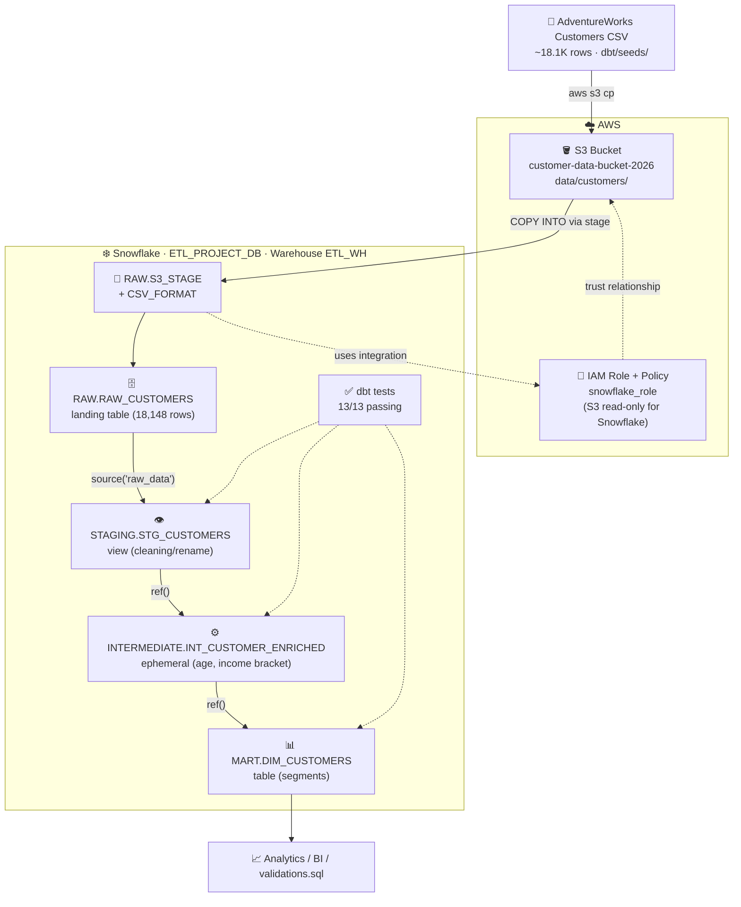
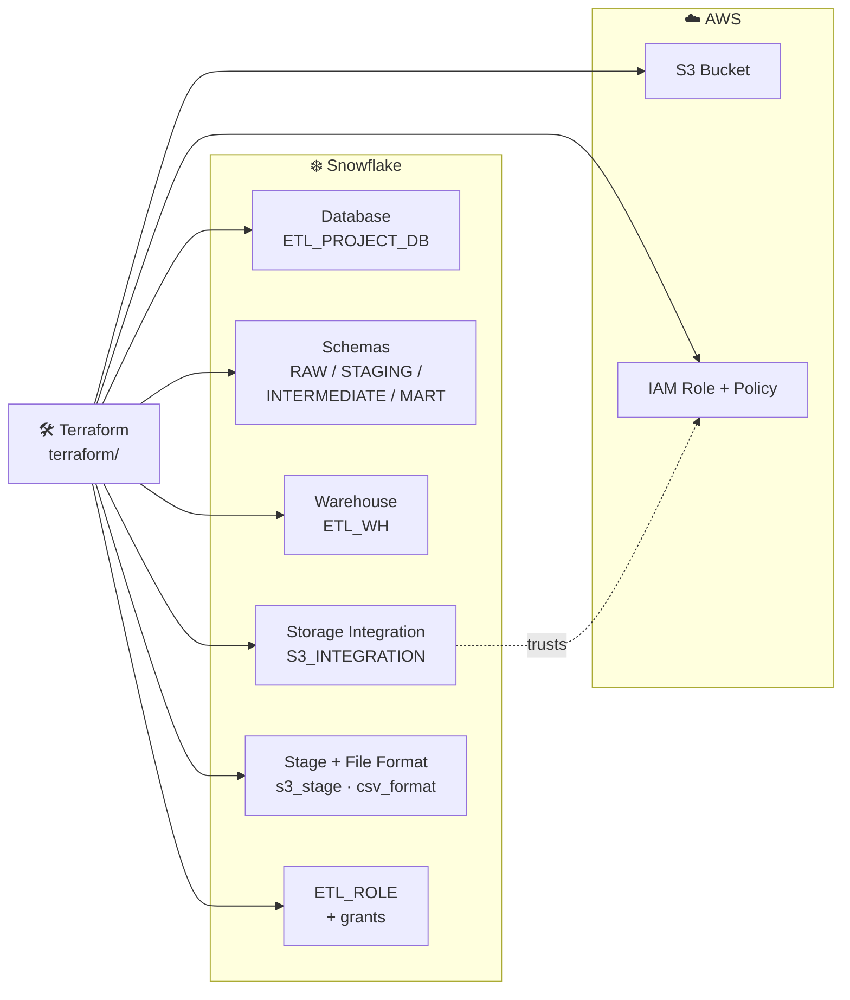
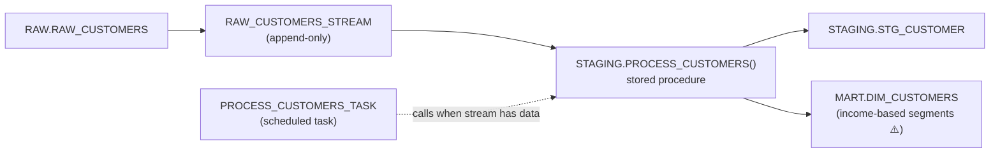
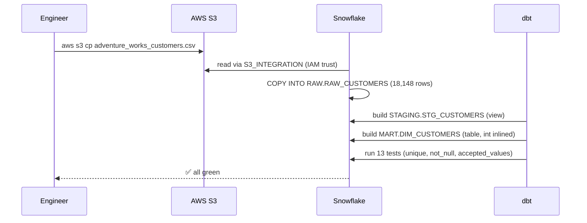

# Data Flow Architecture

How customer data moves through the pipeline, technology by technology.

## 1. High-Level Data Flow

```
 CSV File ──▶ AWS S3 ──▶ Snowflake RAW ──▶ dbt ──▶ MART ──▶ Analytics
 (source)    (landing)     (RAW_CUSTOMERS)  (3 models)  (DIM_CUSTOMERS)  (BI / SQL)
```

## 2. Detailed Flow (Mermaid)

> Renders on GitHub and in VS Code's Markdown preview.



## 3. Terraform Control Plane (provisions everything above)

Terraform doesn't touch the data itself — it owns the objects the data flows through:



## 4. Alternative Path — Manual SQL Scripts (no dbt)

`snowflake_queries/` provides a parallel load path managed by hand. **Run these before dbt** — they `CREATE OR REPLACE` the mart table with a different schema:



⚠️ This table is periodically overwritten by dbt's `dim_customers` (homeowner-based segments). Order matters: **SQL scripts first, dbt last.**

## 5. End-to-End Sequence (one full run)



## Technology Roles Summary

| Technology | Role | Key Objects |
|---|---|---|
| **CSV file** | Data source | `dbt/seeds/adventure_works_customers.csv` |
| **AWS S3** | Raw storage / landing zone | `customer-data-bucket-2026` |
| **AWS IAM** | Access control for Snowflake | `snowflake_role` + S3 policy |
| **Terraform** | Infrastructure as Code (provisioning only) | DB, 4 schemas, warehouse, integration, stage, file format, ETL_ROLE |
| **Snowflake** | Data warehouse: landing + compute | `RAW.RAW_CUSTOMERS`, `ETL_WH` |
| **dbt** | Transformation + data quality tests | `stg_customers` → `int_customer_enriched` → `dim_customers` |
| **SQL scripts** | Alternative manual path + validation queries | `setup.sql`, `procedures.sql`, `validations.sql` |
